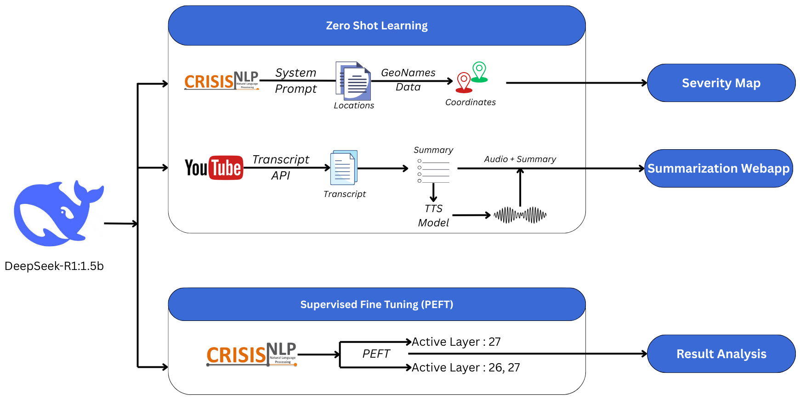

# DELTA : **D**eepSeek for **E**vent-based **L**ocation **T**racking and **A**nalysis
==============================================================

**DELTA** is an advanced framework designed for real-time geolocation extraction and event-based analysis from social media data, specifically focusing on natural disasters such as earthquakes, wildfires, and hurricanes. Leveraging the DeepSeek R1 model with 1.5B parameters, DELTA utilizes cutting-edge techniques to provide information extracted from Twitter and YouTube in the form of text, video, and audio.



🔍 Project Overview
-------------------

DELTA aims to provide a robust solution for:
    
*   **Location Extraction**: Extracting geolocation information from unstructured text.
    
*   **Multi-aspect Support**: Analysing data from multiple countries, events, and social-media platforms (Twitter and YouTube).

*   **Summarisation Webapp**: Fetching relevant YouTube videos from user query, providing a summary of the video and audio file of the summary. 
    
*   **Data Privacy**: Running the model locally without relying on external APIs.
    

📁 Folder Structure
-------------------

```
Project
¦   
+---app
¦       
+---coredata
¦   ¦   
¦   +---test
¦   ¦       
¦   +---train
¦           
+---img
¦       
+---llm
¦   ¦   
¦   +---chatbots
¦   ¦       
¦   +---datasets
¦   ¦       
¦   +---evaluation
¦   ¦       
¦   +---maps
¦   ¦       
¦   +---ner
¦
---README.md           

```


### 1. `app/`
Contains files for webapplication of YouTube video summarization.

- `app.py`: Main file
- Some additional api testing and frontend scripts.

---

### 2. `coredata/`
Contains datasets from previous works and 

- **Test Data (`test/`):**
  - `5xYY.jsonl` file: Processed final testing data of country code YY.
  - JSONL files : backup files created on each step of test data preparation.

- **Train Data (`train/`):**
  - Tagged datasets (`1xfiltered_tagged_gpe.jsonl` to `5xfiltered_tagged_gpe.jsonl` and `output3.jsonl` to `output3.jsonl`)  backup files created on each step of train data preparation.
  - `output4.jsonl` file: Processed final training data (GPE and DISASTER tagged) for custom-NER.
 
- **Large Datasets:**
  - Due to size limits and copyright issues, we have skipped the following datasets to add to the repository. They can be easily accessed from the provided links:
  - `geonames.csv` file: [https://www.geonames.org](https://www.geonames.org)
  - `tweets.csv` file: [https://www.kaggle.com/datasets/swaptr/turkey-earthquake-tweets](https://www.kaggle.com/datasets/swaptr/turkey-earthquake-tweets)

---

### 3. `img/`
Contains plots, diagrams and screenshots of all key findings.

---

### 4. `llm/`
These folders contain additional files and scripts used for experiments and background work. While not part of the primary workflow, they supported the project's development and analysis phases. Due to the complexity and extensive cross-referencing of these files, the detailed documentation of these folders can't be provided and is not necessary.

- **Chat interface (`chatbots/`):**
  - Simple streamlit-based interface to use DeepSeek-R1 1.5B model as user.

- **Key dataset (`datasets/`):**
  - Multi-hazard and multi-lingual preprocessed tweets with result columns.
 
- **Comparison and Performance Computation (`evaluation/`):**
  - `compare_YY.ipynb` file: Comparison of model outputs with ground truth for tweets of country code YY.
  - `error_computation.ipynb` file: Computing and plotting performance metrics for each dataset.
 
- **Epicenter and Severity Maps (`maps/`):**
    - `epicentre_JP.html` file: USGS epicenter map
    - `jp_locations_map.html` file: All key Japan locations map
    - `severity_map_deepseek.html` file: Severity map generated from DeepSeek outputs
    - `severity_map_spacy.html` file: Severity map generated from fine-tuned spaCy model outputs

- **Named Entity Recognition (`ner/`):**
  - `1_5btest_YY` file: Running model locally to identify locations from tweets of country code YY
 
- **Additional Files** for response cleaning, model dissection, fine-tuning, and latency analysis.

---

## Country Code List:

- `JP` : Japan
- `TR` : Turkey
- `MX` : Mexico
- `US` : USA
- `IT` : Italy
- `CA` : Canada

---

## 🚀 Running the Streamlit App

Follow these steps to run the Streamlit-based web application locally:

1. Navigate to the app directory
Go to the folder where the Streamlit app code is located:

```bash
cd app
```
2. Run the Streamlit app
Use the following command to launch the app:

```bash
streamlit run app.py
```
3. Access the application
After running the above command, Streamlit will automatically open your default browser.

---
